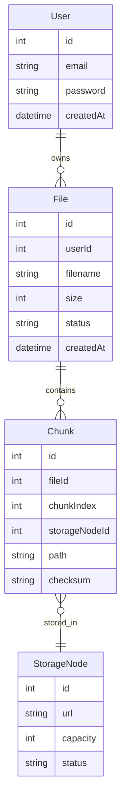

# 🗄️ Database Design

---

## 📊 ER Diagram

---

## 🧩 Tables

### User

* Stores authentication data

### File

* Represents uploaded file
* Tracks upload status

### Chunk

* Represents a piece of file
* Maps to storage node

### StorageNode

* Represents physical storage server

---

## ⚡ Indexing

* `file.userId`
* `chunk.fileId`
* `(fileId, chunkIndex)` composite

---

## 🧠 Notes

* No actual file stored in DB
* Only metadata + references
* Chunk checksum ensures integrity
