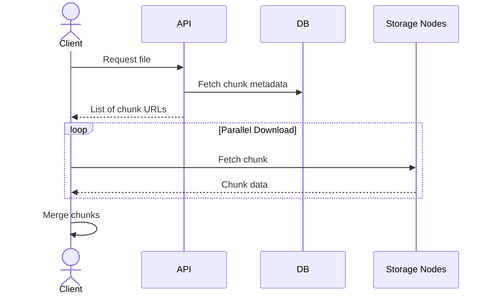

# 🔽 Download Flow

---

## 🧭 Sequence Diagram

---

## ⚙️ Steps

1. Client requests file
2. API returns chunk locations
3. Client downloads chunks in parallel
4. Client reconstructs file

---

## 🚀 Benefits

* Faster downloads (parallel)
* Scalable read performance
