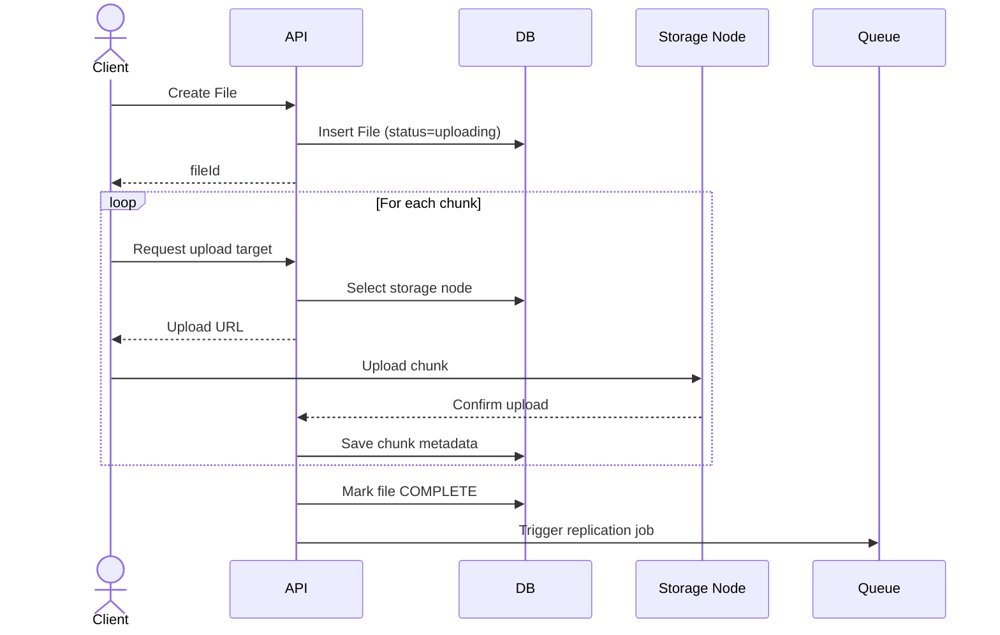

# 🔼 Upload Flow (Chunked & Resumable)

---

## 🧭 Sequence Diagram

---

## ⚙️ Steps Explained

1. Client creates file record
2. File split into chunks (e.g., 5MB)
3. Each chunk uploaded independently
4. Metadata stored per chunk
5. File marked complete after all chunks uploaded
6. Background replication starts

---

## 🚀 Key Benefits

* Resume uploads
* Parallel uploads
* Efficient retries
